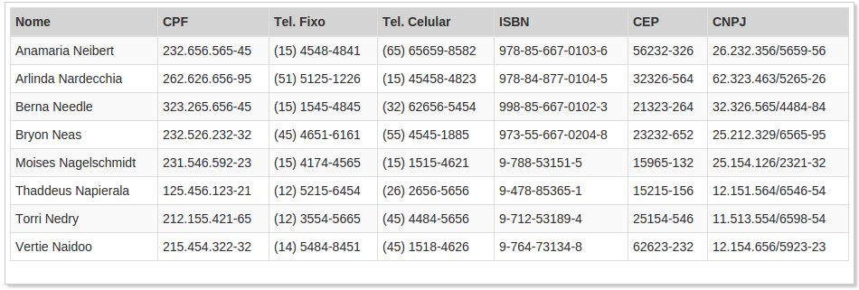

# easy-mask

Um simples pacote para uso de máscaras no django [demo]




## Instalação

```
    pip install easy-mask
```
    
## Configuração

Adicione o pacote ao [__INSTALLED_APPS__](https://docs.djangoproject.com/en/1.9/ref/settings/#installed-apps)

```python
INSTALLED_APPS = [
    'easy_mask',
]
```

para usar o mesmo, basta adicionar `` no inicio de `template/html`, tendo em mente que, se estiver usando uma extensão de algum template lembre-se sempre de colocar o `` abaixo do mesmo, da seguinte forma:

```python
    
    
```

## Exemplo de uso

```python
    
      <tr>
        <td>{{ data.cpf | cpf }}</td>
        <td>{{ data.phone | phone }}</td>
        <td>{{ data.cnpj | cnpj }}</td>
        <td>{{ data.cep | cep }}</td>
      </tr>
    
```

## Observação

As máscaras existentes são:

- `phone`
- `cpf`
- `rg`
- `cnpj`
- `cep`
- `ncm`
- `isbn` (sugestão do [alephmelo])

Gostaria de ver alguma máscara que ainda não existe no projeto? então abra uma issue __[aqui]__, e deixe na descrição um exemplo de como seria essa máscara :smiley:.

[aqui]:https://github.com/dhelbegor/easy-mask/issues
[demo]:https://easy-mask.herokuapp.com
[alephmelo]:https://github.com/alephmelo
